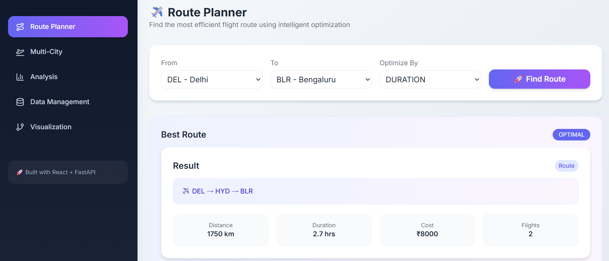
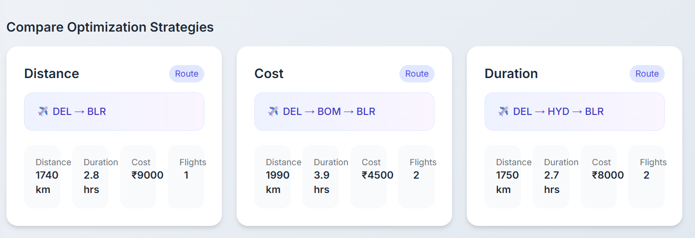
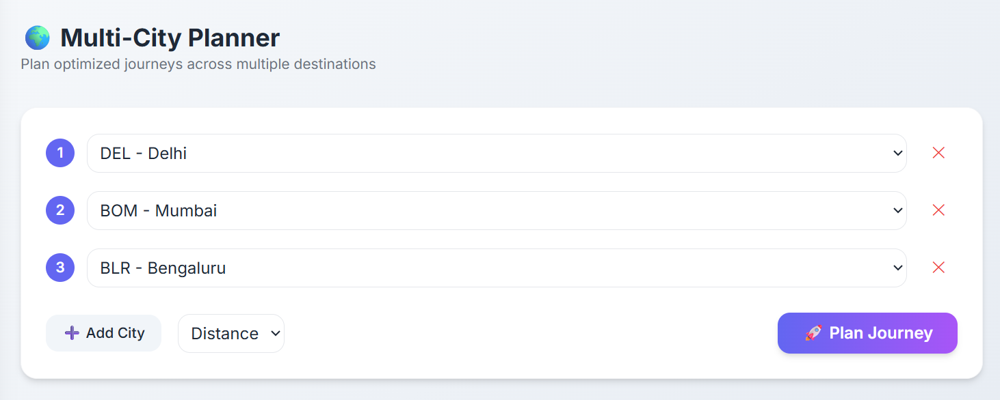
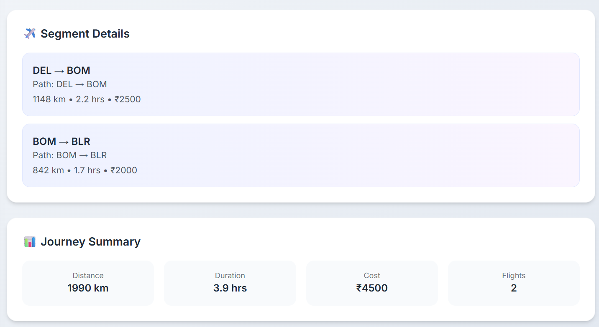
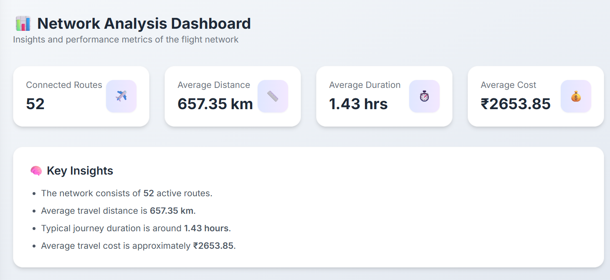
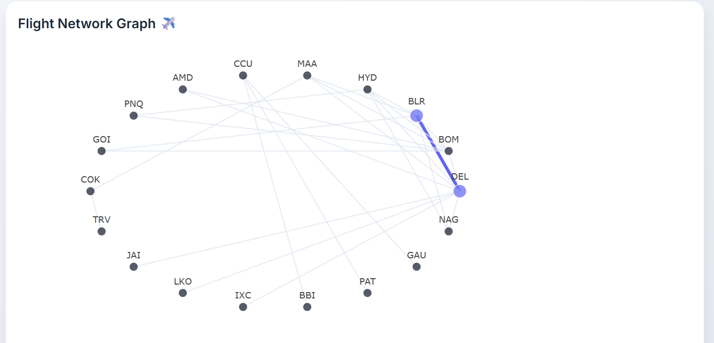
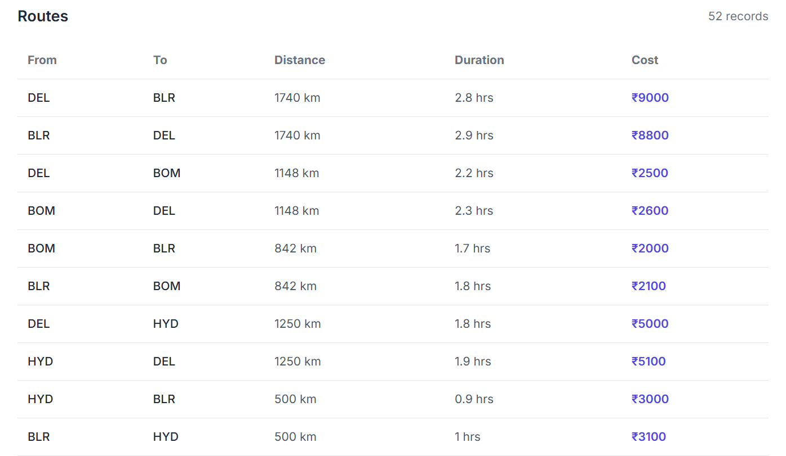
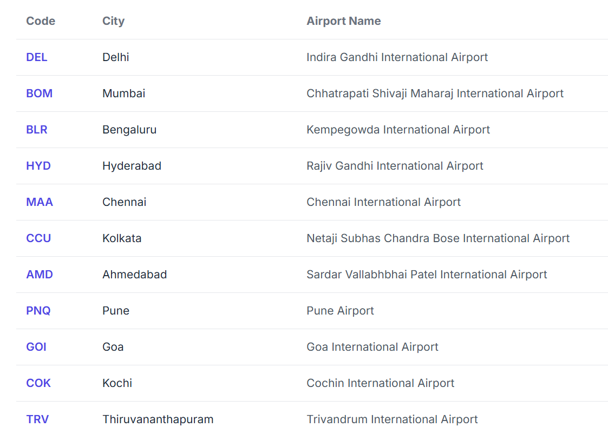

# ✈️ Indian Flight Route Planning System

A full-stack web application that finds optimal flight routes between Indian cities using **Dynamic Programming (Floyd–Warshall Algorithm)**.

---

## 🚀 What This Project Does

* Finds the **best route between cities**
* Compares routes based on:

  * 📏 Distance (Shortest)
  * 💰 Cost (Cheapest)
  * ⏱️ Duration (Fastest)
* Supports **multi-city journey planning**
* Displays **network insights and visualizations**

---

## 🛠️ Tech Stack

* **Frontend:** React + Tailwind CSS + Plotly
* **Backend:** FastAPI (Python)
* **Algorithm:** Floyd–Warshall
* **Concept:** Dynamic Programming (DP)

---

## 🧠 Where Dynamic Programming is Used

This project uses the **Floyd–Warshall Algorithm**, a classic **Dynamic Programming technique**.

### 📌 Idea

Instead of checking all routes repeatedly, we:

* Store shortest paths
* Reuse them to compute better paths

### 📌 Formula Used

[
dist[i][j] = min(dist[i][j],; dist[i][k] + dist[k][j])
]

### 📌 Explanation

* `i → j` = current route
* `i → k → j` = possible better route
* We update if going via `k` is shorter

👉 This is **Dynamic Programming** because:

* It solves **overlapping subproblems**
* It stores results and **reuses them efficiently**

---

## ✈️ How It Works in This Project

* Cities = **nodes**
* Flights = **edges**
* Each edge has:

  * distance
  * cost
  * duration

The algorithm runs separately for each metric to give:

* Shortest route
* Cheapest route
* Fastest route

---

## 📸 Screenshots

### ✈️ Route Planner



---

### 🔄 Route Comparison



---

### 🌍 Multi-City Planner





---

### 📊 Network Analysis



---

### 🌐 Visualization



---

### 🗂️ Data View





---

## ⚙️ How to Run

### Backend

```bash
cd backend
pip install -r requirements.txt
uvicorn main:app --reload
```

### Frontend

```bash
cd frontend
npm install
npm run dev
```

---

## 🎯 Why This Project is Important

* Demonstrates **real-world use of Dynamic Programming**
* Shows how graph algorithms solve **optimization problems**
* Combines **DSA + Full Stack Development**

---

## 👩‍💻 Author / Contributors

**Arshika Singh**(Project Owner)
**Sripragna Akula**(Contributors)
